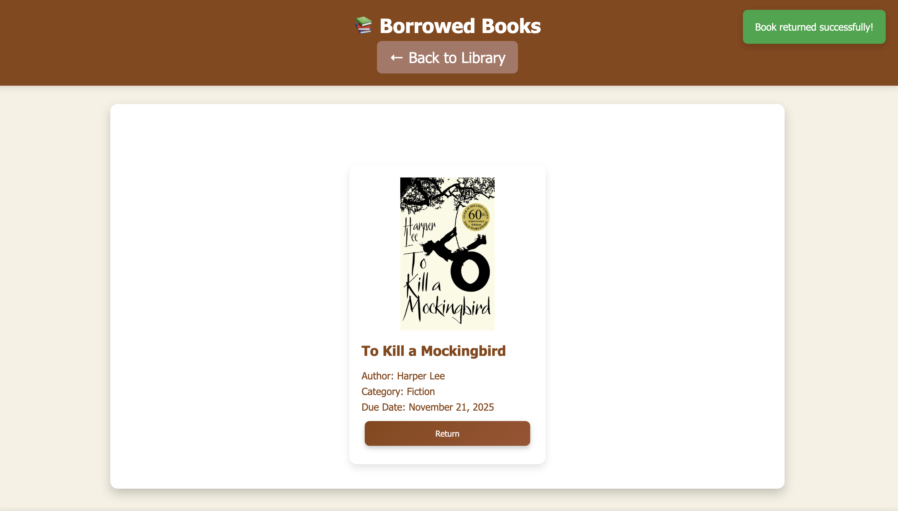
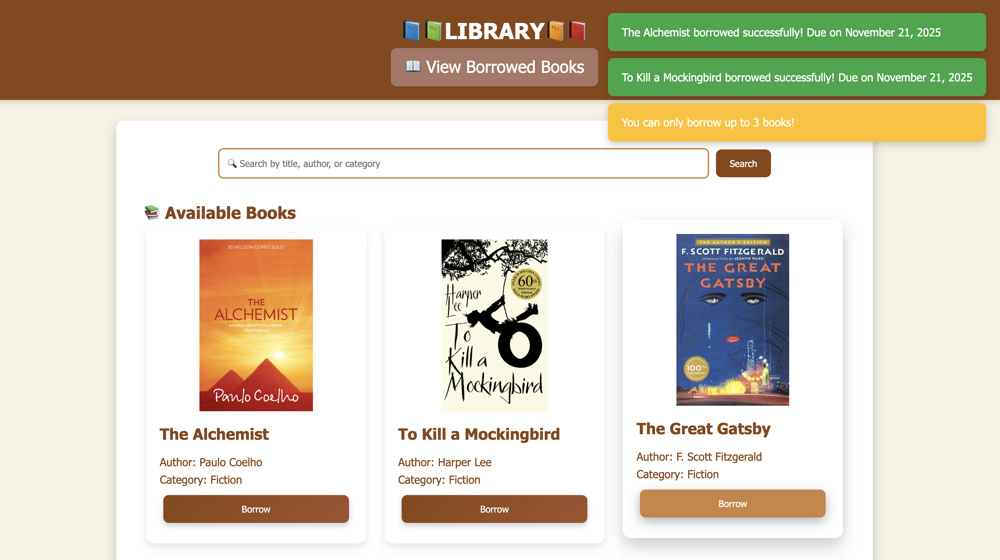
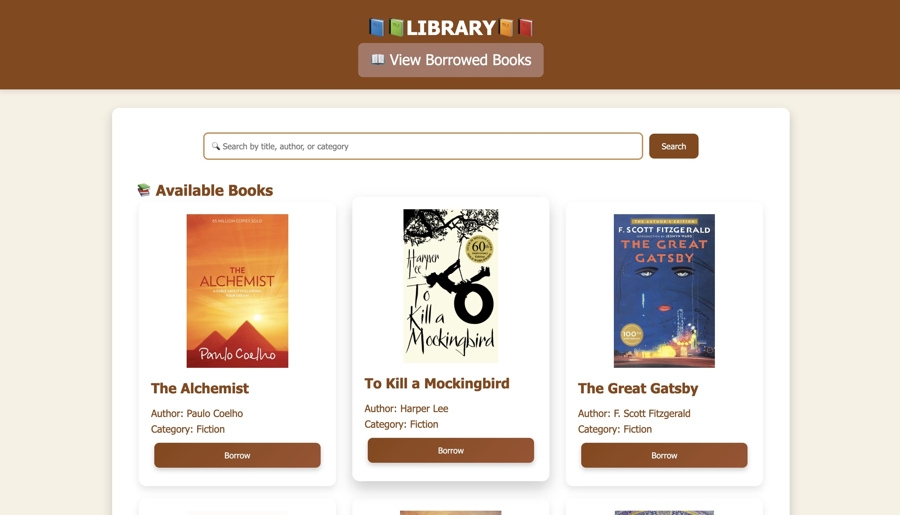

# 📚 Library Management System

A clean and visually appealing **Library Management System** web application that allows users to browse, search, and borrow books with ease.  
This project focuses on providing a **user-friendly UI** along with core library functionalities.

---

## 🎯 Features

- 🔍 **Search** books by title, author, or category
- 📖 **View Available Books** with cover images and details
- 🧾 **Borrow Books** in a single click
- 📚 **View Borrowed Books** section to track issued books
- 🎨 **Beautiful & Modern UI** (Responsive & Clean)

---

## 🖼️ Screenshots

### ✅ Home Page (Available Books Section)

### 📚 Borrowed Books Page

### 🔎 Search Feature Preview

---

## 🛠️ Tech Stack

| Technology | Purpose |
|-----------|---------|
| **HTML** | Structure / Page layout |
| **CSS** | Styling & UI design |
| **JavaScript** | Logic & Interactivity |
| **LocalStorage** *(optional)* | Store borrowed book data |

---

## 📂 Project Structure

